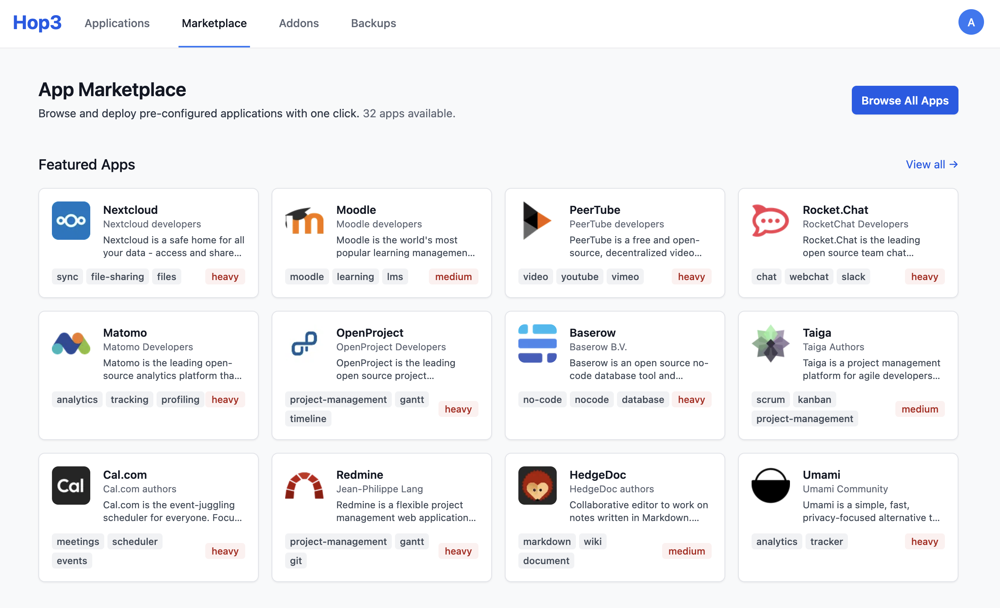
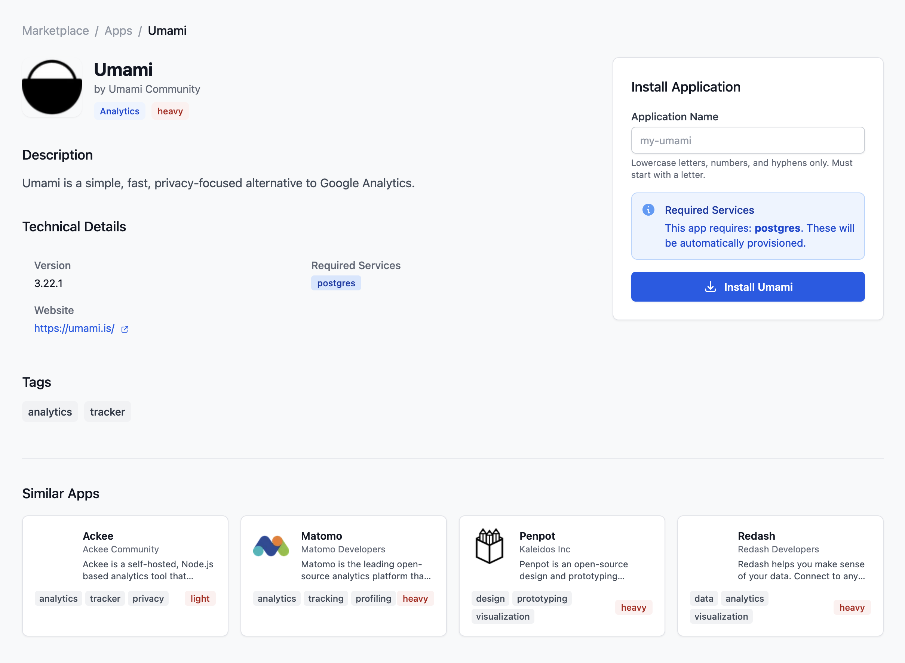
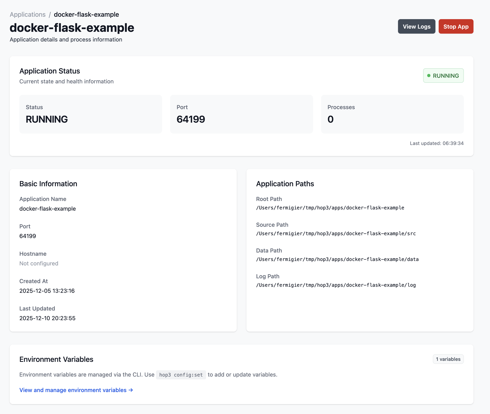
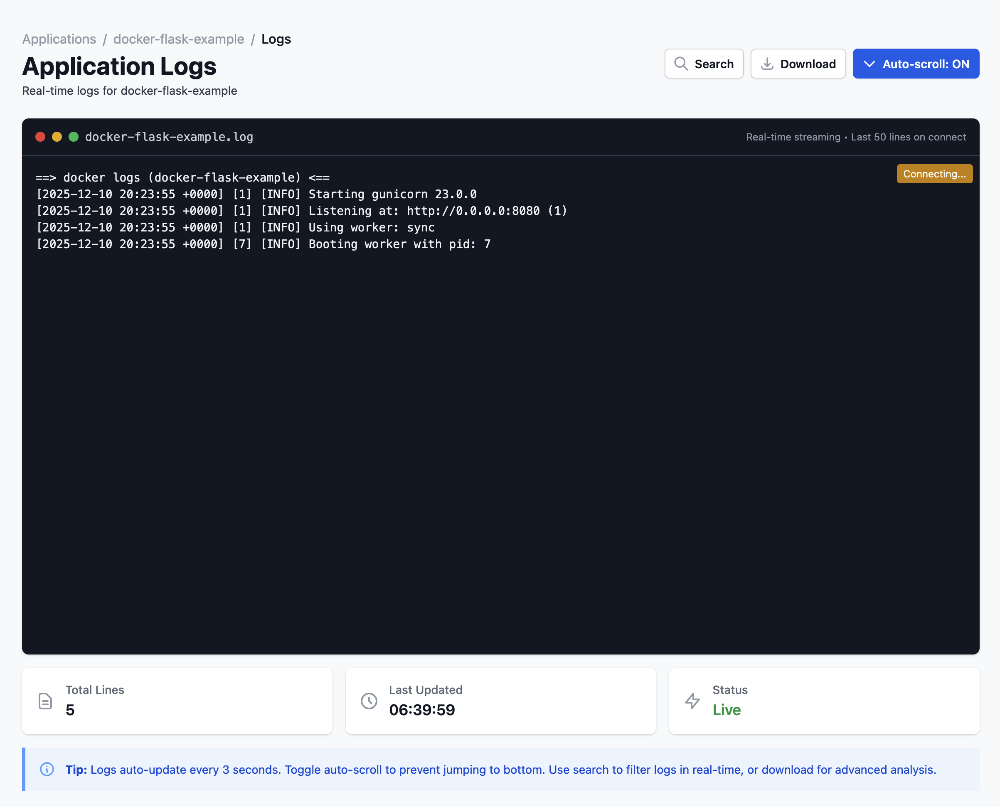
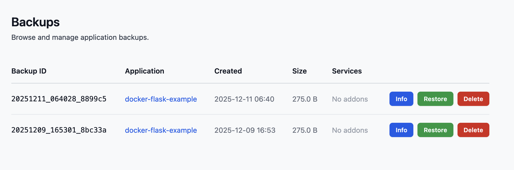

<!-- prezo
theme: dark
show_clock: true
show_elapsed: true
-->

# Hop3

## From Self-Hosting Complexity to Production-Ready Sovereignty

### An Open-Source PaaS for Digital Autonomy

OSXP 2025, Paris
Stefane Fermigier (PhD), CEO, Abilian

---

# Part 1: The Sovereignty Paradox

---

# The Promise of Self-Hosting


**Digital sovereignty** is the ability to control your own digital destiny:
- Your data stays yours
- Your infrastructure, your rules
- No vendor lock-in
- Full transparency and auditability

**Open source software** should be the foundation of this sovereignty.

Yet most organizations **give up** and hand their data to hyperscalers.

**Why?**

---

# The Reality: Operational Chaos


Self-hosting F/OSS applications means:

**Constant Complexity:**
- Infrastructure provisioning
- Configuration management
- Dependency hell
- Security patching

**Operational Burden:**
- Monitoring & alerting
- Backup & disaster recovery
- SSL certificate management
- Log aggregation

**The cruel irony:** To gain sovereignty, you need a dedicated DevOps team.

---

# Our Thesis

**The solution isn't to work harder — it's to build smarter platforms.**

What if we could:
- Deploy any F/OSS app with a single click, CLI command or `git push`
- Automatic SSL, backups, monitoring
- One-click service provisioning (PostgreSQL, Redis...)
- Web UI for non-technical administrators
- Reproducible, deterministic environments

**This is Hop3.**

---

# Part 2: Engineering a Sovereign PaaS

---

# Introducing Hop3


**Hop3** is an open-source Platform-as-a-Service that makes self-hosting practical.

**What we deliver:**
- **Complete lifecycle management:** build, deploy, maintain, secure, backup
- **Production-grade reliability** without DevOps expertise
- **Full control** over your infrastructure and data

**License:** Apache

**Target users:**
- SMEs deploying internal tools
- IT departments managing F/OSS portfolios
- Developers who want simple deployments

---

# Application Lifecycle


---

# Architecture Philosophy

**12-Factor App Foundation:**
- Declarative configuration (`hop3.toml` or `Procfile`)
- Strict separation of config from code
- Backing services as attached resources
- Stateless processes, disposable environments

**Beyond 12 Factors:**
- **Security by design:** Fernet-encrypted credentials, JWT auth
- **Sustainability:** Runs on modest hardware, energy-conscious
- **Extensibility:** Plugin architecture (Pluggy + Dishka DI)

---

# The Web Dashboard


**For administrators who prefer GUIs:**
- Real-time application status
- Live log streaming
- Service attachment visualization
- Backup management
- Environment variable editing

**No CLI required** for day-to-day operations.

Built with: Litestar, HTMX, Tailwind CSS

---

# CLI Overview

```
$ hop help
USAGE
    $ hop <command> <args>

COMMANDS
    admin     Administrative commands
    app       Commands for managing app instances
    apps      List all applications
    backup    Run a backup for an app
    config    Manage an application config / env
    deploy    Deploy an application
    pg        Manage PostgreSQL databases
    redis     Manage Redis instances
    run       Run a command in app context
    sbom      Generate SBOM for an app
```

---

# Declarative Configuration

**`hop3.toml`** - Your application's complete specification:

```toml
[metadata]
id = "my-nextcloud"
version = "1.0.0"

[run]
start = "php-fpm"

[env]
NEXTCLOUD_ADMIN_USER = "admin"
NEXTCLOUD_TRUSTED_DOMAINS = "cloud.example.com"

[[provider]]
name = "postgres"
version = "15"

[[provider]]
name = "redis"
```

No Kubernetes YAML. No Docker Compose complexity.

---

# Backing Services: First-Class Citizens

**PostgreSQL, Redis, MySQL...** with full lifecycle management.

**Operations:**
- Provision with one command
- Attach to any application
- Automatic credential injection
- Backup & restore integration

**Security:**
- Fernet AEAD encryption at rest
- Credentials never in plaintext
- Per-service isolation

```bash
hop3 addons:create postgres mydb
hop3 addons:attach mydb --app my-nextcloud
# DATABASE_URL automatically injected
```

---

# Backup & Restore: Built-In

**Complete data protection**, not an afterthought:

```
backup/
├── metadata.json      # SHA256 checksums
├── source.tar.gz      # Application code
├── data.tar.gz        # User data
├── env.json           # Configuration
└── services/
    └── postgres_mydb.sql
```

**Features:**
- Integrity verification (SHA256)
- Service-aware (PostgreSQL, MySQL, Redis...)
- Point-in-time recovery

---

# Plugin Architecture

**Everything is extensible:**

**Build Strategies:**
- Native (Python, Node, Go, Rust...)
- Docker (Dockerfile)
- Nix (coming soon)

**Deployment Runtimes:**
- uWSGI Emperor
- Docker Compose
- Systemd (planned)

**Proxy Backends:**
- Nginx (default)
- Caddy, Traefik

**Built with Pluggy** + **Dishka** (dependency injection)

---

# Part 3: Live Demonstration

---

# Demo: Deploying a Flask App

**Scenario:** Deploy a Python Flask app with PostgreSQL database.

**Steps:**
1. Create app files and deploy
2. Check status and configure environment
3. Create and attach PostgreSQL database
4. View logs and create backup
5. Generate SBOM for compliance

---

# Step 1: Create & Deploy

```python
# app.py
from flask import Flask
app = Flask(__name__)

@app.route('/')
def hello():
    return '<h1>Hello, World!</h1>'
```

```bash
$ hop deploy demo-app ./app-dir
> Starting deployment for app 'demo-app'
-> Build successful
-> Deployment successful
> App running at: http://127.0.0.1:53329
```

---

# Step 2: Check Status

```bash
$ hop app:status demo-app
┏━━━━━━━━━━━┳━━━━━━━━━━━━━━━━━━━━━━━━┓
┃ Property  ┃ Value                  ┃
┡━━━━━━━━━━━╇━━━━━━━━━━━━━━━━━━━━━━━━┩
│ Name      │ demo-app               │
│ Status    │ RUNNING                │
│ Instances │ 1                      │
│ Local URL │ http://127.0.0.1:53329 │
└───────────┴────────────────────────┘

$ hop app:ping demo-app
✓ App 'demo-app' is responding
```

---

# Step 3: Configure Environment

```bash
$ hop config:set demo-app APP_NAME=Hop3Demo
Updated configuration for 'demo-app':
  • Set APP_NAME=Hop3Demo

$ hop config:show demo-app
┏━━━━━━━━━━━━━┳━━━━━━━━━━━━┓
┃ Key         ┃ Value      ┃
┡━━━━━━━━━━━━━╇━━━━━━━━━━━━┩
│ APP_NAME    │ Hop3Demo   │
└─────────────┴────────────┘
```

---

# Step 4: Create PostgreSQL Database

```bash
$ hop addons:create postgres demo-db
Addon 'demo-db' created successfully.

$ hop addons:attach demo-db --app demo-app
Addon 'demo-db' attached to app 'demo-app'.

Environment variables:
  Added DATABASE_URL
  Added PGDATABASE, PGUSER, PGPASSWORD
  Added PGHOST, PGPORT
```

---

# Step 5: Create Backup

```bash
$ hop backup:create demo-app
Creating backup for app 'demo-app'...

✓ Backup created successfully!

Backup ID: 20251211_062736_3beb5f
Total size: 270.0 B

$ hop backup:list demo-app
┏━━━━━━━━━━━━━━━━━━━━━━━━┳━━━━━━━━━┳━━━━━━━━━━━┓
┃ BACKUP ID              ┃ SIZE    ┃ STATUS    ┃
┡━━━━━━━━━━━━━━━━━━━━━━━━╇━━━━━━━━━╇━━━━━━━━━━━┩
│ 20251211_062736_3beb5f │ 270.0 B │ COMPLETED │
└────────────────────────┴─────────┴───────────┘
```

---

# Web UI: Marketplace



**Rich app ecosystem** - Browse and deploy pre-configured applications.

---

# Web UI: One-Click Deployment



View app information, requirements, and deploy with a single click.

---

# Web UI: Application Overview



**Full control** - Manage configuration, view logs, control lifecycle.

---

# Web UI: Application Details



**Real-time status** - Monitor with logs and live updates.

---

# Web UI: Backup Management



View all backups across your applications.

---

# Part 4: The Open Internet Stack

---

# Hop3 in the European F/OSS Ecosystem

**Funded (in part) by European research programs:**

**NEPHELE** (Horizon Europe)
- Cloud-edge orchestration research
- Docker / Kubernetes / Karmada backend
- **Pure research (TRL 3-4)**

**NGI Zero Commons Fund** (NLnet)
- Security & resilience
- "Nix Integration for Hop3"
- Robust testing infrastructure
- **TRL 5-8: Experimental development**

---

# NGI0: Towards Reproducible Sovereignty

**Security & Resilience (90% complete):**
- Encrypted credential storage (Fernet AEAD)
- Web Application Firewall (LeWAF)
- Database migrations (Alembic)
- Backup/restore system
- Comprehensive testing (435+ tests)
- Web UI dashboard with SSE logs

**What it enables:**
- Trustworthy deployments for public institutions
- Auditable infrastructure for compliance
- Sustainable self-hosting for SMEs

---

# LeWAF: Web Application Firewall

**LeWAF** = Lightweight Web Application Firewall

**What it is:**
- Pure Python WAF engine
- ModSecurity SecLang compatible
- **92% OWASP CRS** rule support
- Prevents: SQL injection, XSS, path traversal...

**Performance:**
- Sub-millisecond latency (~0.1ms)
- 12,000+ requests/second

```toml
[waf]
enabled = true
ruleset = "owasp-crs"
paranoia_level = 1
```

---

# Why Nix Matters for Sovereignty

- **Reproducibility:** Same inputs → identical outputs, forever
- **Auditability:** Complete dependency graph
- **Security:** Immutable builds, instant rollback
- **Sustainability:** Builds work years later

**Roadmap:**
- Nix builder plugin for apps
- Nix-based Python/Node builders
- Goal: **Bit-perfect, reproducible deployments**

---

# The Open Internet Stack Vision

**NGI has funded hundreds of F/OSS building blocks.**
**Who deploys them?**

Hop3 aims to be the **operational layer** that:
- Makes NGI-funded software deployable by anyone
- Provides the "glue" between components
- Enables sustainable self-hosting

**The vision:**
From individual tools → integrated, sovereign infrastructure.

---

# Roadmap: 2025-2026

**Q4 2025 (now):**
- Single-server PaaS
- CLI + JSON-RPC API
- Docker and native builds
- Web admin dashboard
- PostgreSQL, Redis, MySQL addons
- Backup/restore, WAF

**Q1 2026:**
- Identity management (LDAP, OIDC...)
- Nix builder and runtime plugins
- More addons (MongoDB, S3...)
- Monitoring & alerting

---

# Why Hop3 Matters


**For Digital Sovereignty:**
- Full control, no lock-in
- Transparent, auditable
- OSS-licensed

**For the F/OSS Ecosystem:**
- Makes self-hosting viable
- Bridges the "deployment gap"

**For Europe:**
- Concrete implementation of digital autonomy
- Production-ready, not just research

---

# Get Involved


**Try it:**
- Documentation: hop3.cloud
- Source: github.com/abilian/hop3
- LeWAF: github.com/abilian/lewaf

**Contribute:**
- Code, documentation, testing
- Application packaging
- Feedback and bug reports

---

# Questions?

**Thank You!**

Stefane Fermigier
sf@abilian.com

hop3.cloud | github.com/abilian/hop3

---

# Image Credits

Images from Freepik:
- Server room, IT professional, blueprints
- Gold pot, roadmap, target
- People working

Hackathon photo: EU OS Hackathon

Logos used with permission.
